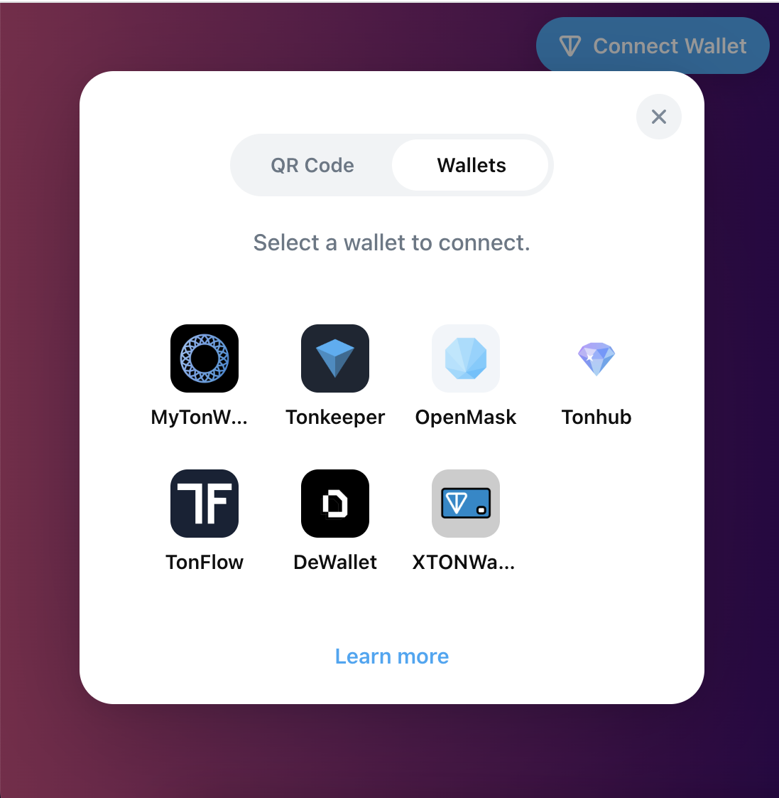
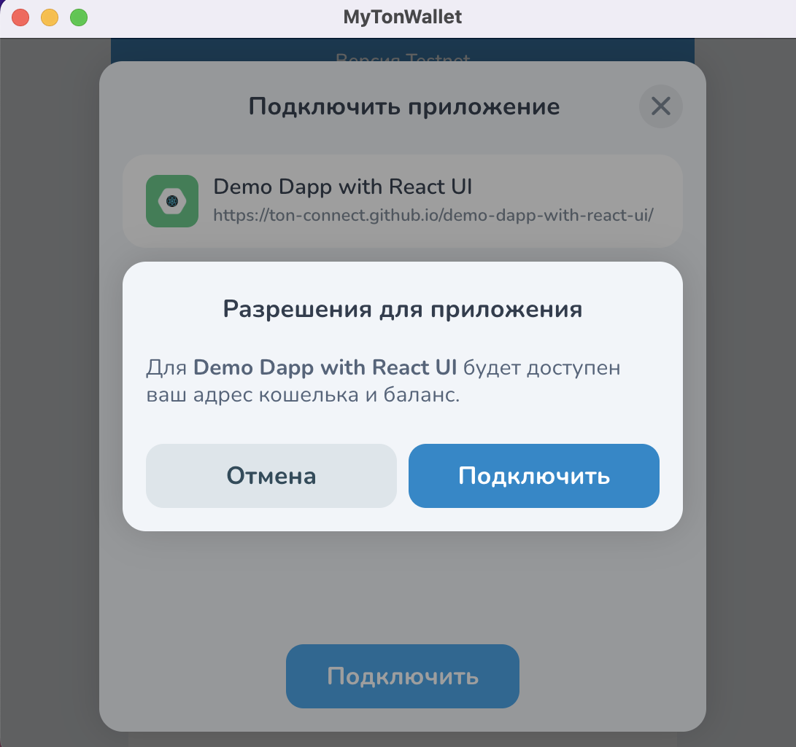
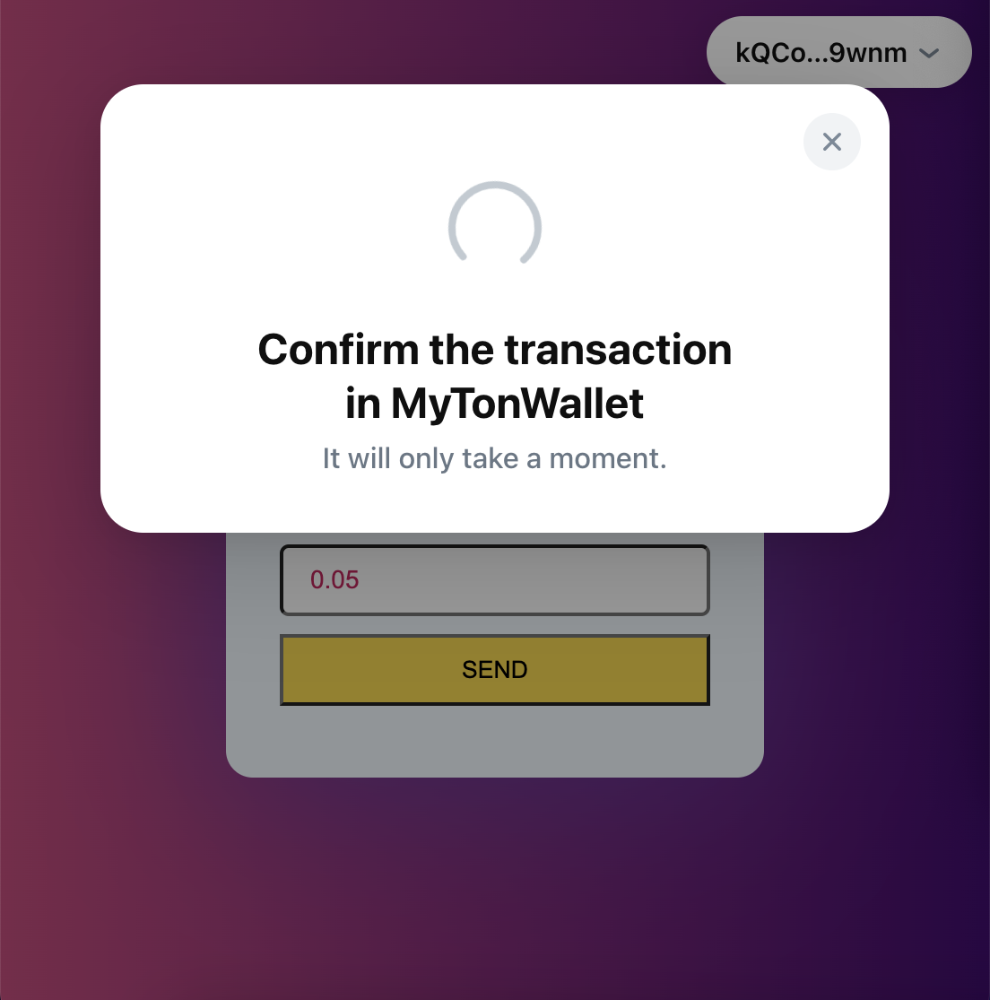
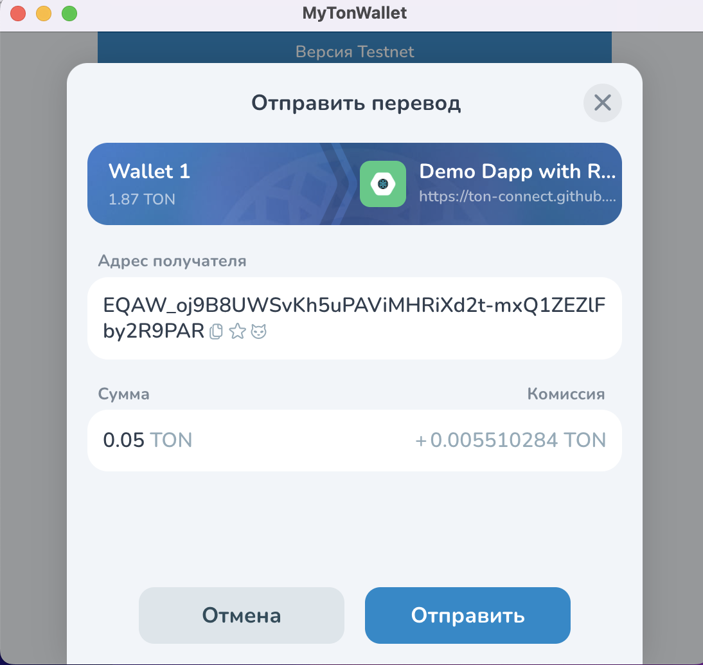
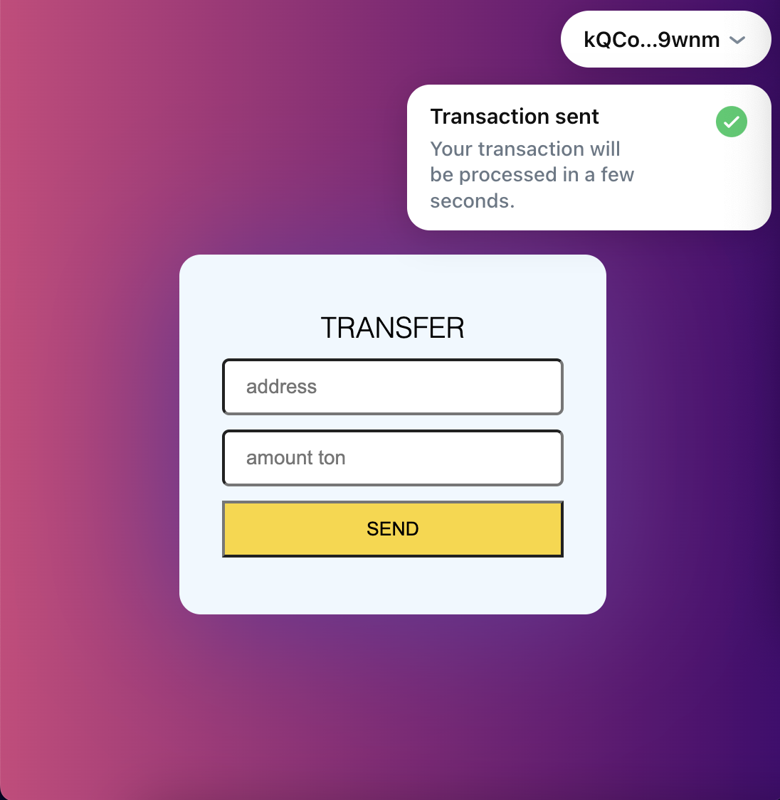

# ton_wallet_transfer Python
Для перевода необходима ваша seed фраза, после испонения скрипта транзакию можно отследить в сканере

# ton_wallet_transfer

# Сценарий взаимодействия
# Выбор Кошелька
При нажатии на кнопку connect wallet открывается окно с выбором кошелька из предложенных

# Подключение
После выбора кошелька, открывается кошелек с подтверждением подключения

# Ввод данных
Для совершения транзакции необходимо ввсети адрес и количество токенов, если не ввести адресс или количество токенов, то появится ошибка

# Транзакция
При нажатии кнопки send появляется окно ожидания подтверждения транзакции

А в кошельке кнопка подтверждения

# Заверщение транзакции
После завершения транзакции появляется уведомление о ее завершении

